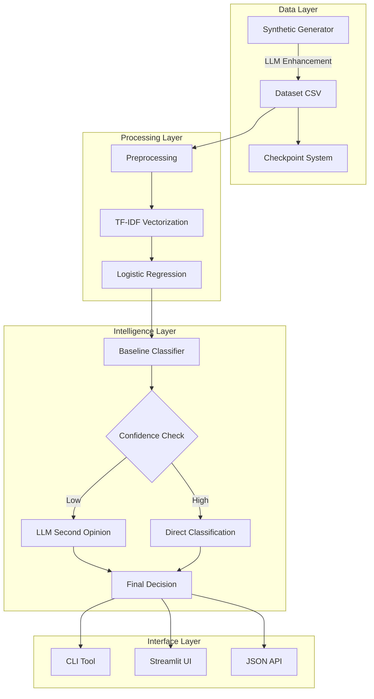

# System Architecture

## Overview

The NLP-Driven Incident Triage system consists of multiple interconnected components that work together to provide intelligent incident classification.

## Component Diagram

## Components

### Data Generation

- **Generator**: Creates synthetic incidents with MITRE enrichment
- **LLM Rewriter**: Enhances narratives using llama.cpp
- **Checkpoint System**: Enables resumable generation

### Processing Pipeline

- **Text Cleaning**: Unicode normalization, lowercase, punctuation
- **TF-IDF**: Bag-of-words with bigrams (~5k features)
- **Classifier**: Logistic Regression with class balancing

### Intelligence Layer

- **Uncertainty Detection**: Configurable confidence thresholds
- **LLM Integration**: Local llama.cpp for second opinions
- **Guardrails**: JSON parsing, keyword validation, label normalization

### Interfaces

- **CLI**: Rich-formatted terminal interface
- **Streamlit UI**: Interactive web dashboard
- **JSON Output**: Scriptable batch processing

## Data Flow

1. **Generation**: Synthetic incidents created with optional LLM enhancement
2. **Storage**: CSV format with checkpointing for large datasets
3. **Preprocessing**: Shared cleaning pipeline ensures consistency
4. **Vectorization**: TF-IDF transforms text to numerical features
5. **Classification**: Baseline model produces probability distribution
6. **Uncertainty Handling**: Low-confidence cases routed to LLM
7. **Output**: Results delivered via CLI, UI, or JSON

## Technology Stack

- **Python 3.11+**: Core language
- **scikit-learn**: ML framework
- **llama-cpp-python**: Local LLM inference
- **Streamlit**: Web UI framework
- **Rich**: Terminal formatting
- **pytest**: Testing framework
- **MkDocs Material**: Documentation

See [Model Information](model-information.md) for ML details.
