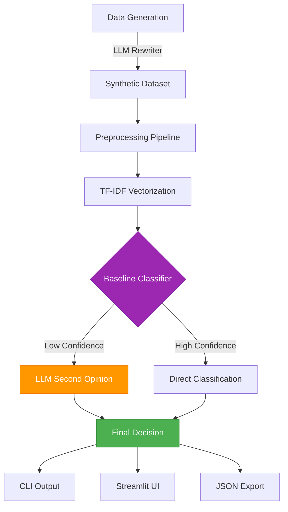

# NLP-Driven Incident Triage

**Educational cybersecurity incident triage platform** demonstrating intelligent classification through Natural Language Processing, LLM enhancement, and uncertainty-aware predictions.

<div class="grid cards" markdown>

- :material-lightning-bolt:{ .lg .middle } **Quick Start**

  ***

  Get up and running in minutes with our streamlined setup guide

  [:octicons-arrow-right-24: Getting Started](getting-started.md)

- :material-console:{ .lg .middle } **CLI Tool**

  ***

  Powerful command-line interface for incident classification

  [:octicons-arrow-right-24: CLI Usage](cli.md)

- :material-view-dashboard:{ .lg .middle } **Web Interface**

  ***

  Interactive Streamlit UI with visual analytics and bulk processing

  [:octicons-arrow-right-24: UI Guide](ui-guide.md)

- :material-database:{ .lg .middle } **Dataset Generation**

  ***

  Create synthetic SOC datasets with LLM enhancement

  [:octicons-arrow-right-24: Data & Generator](data-and-generator.md)

</div>

---

## Overview

An **educational/research platform** demonstrating intelligent cybersecurity incident triage through Natural Language Processing. This project showcases how analyst-style narratives can be converted into structured incident categories using a transparent, reproducible ML workflow.

!!! warning "Educational Project - Not Production IR Tooling"
This project is designed for **education, research, and portfolio demonstration**.  
 It is **not** a drop-in replacement for enterprise incident response systems and should not be deployed unsupervised in a live SOC environment.

---

## ✨ Key Features

<div class="grid cards" markdown>

- :material-robot:{ .lg .middle } **LLM-Enhanced Generation**

  ***

  Local llama.cpp models for privacy-first intelligent dataset creation with sanitization and caching

- :material-chart-line:{ .lg .middle } **Uncertainty-Aware Classification**

  ***

  TF-IDF + Logistic Regression with configurable thresholds and intelligent fallback handling

- :material-brain:{ .lg .middle } **Second-Opinion Engine**

  ***

  LLM assistance for uncertain cases with JSON guardrails and hallucination prevention

- :material-chart-box-outline:{ .lg .middle } **Interactive Analytics**

  ***

  Streamlit UI with real-time classification, bulk analysis, and visual threat intelligence

- :material-monitor-dashboard:{ .lg .middle } **Production Monitoring**

  ***

  Real-time progress tracking, ETA calculation, and resource efficiency metrics

- :material-test-tube:{ .lg .middle } **Research-Grade Dataset**

  ***

  100k synthetic incidents with MITRE ATT&CK enrichment and realistic noise

</div>

---

## 🏗️ Architecture Overview



---

## 🎯 Use Cases

=== "Education"

    - Learn NLP techniques for cybersecurity
    - Understand uncertainty-aware classification
    - Explore MITRE ATT&CK framework integration
    - Study SOC automation concepts

=== "Research"

    - Prototype triage automation ideas
    - Experiment with LLM-enhanced generation
    - Test classification algorithms
    - Develop synthetic security datasets

=== "Portfolio"

    - Demonstrate ML engineering skills
    - Showcase end-to-end project development
    - Highlight production-grade tooling
    - Present interactive visualizations

---

## 🚀 Quick Examples

### CLI Classification

```bash
# Basic incident analysis
nlp-triage "User reported suspicious email with attachment"

# JSON output for scripting
nlp-triage --json "Multiple failed login attempts detected"

# LLM-assisted bulk processing
nlp-triage --llm-second-opinion \
  --input-file incidents.txt \
  --output-file results.jsonl
```

### Dataset Generation

```bash
# Quick generation (1000 incidents)
python generator/generate_cyber_incidents.py --n-events 1000

# Production with monitoring
./generator/launch_generator.sh 50000 my_dataset
./generator/monitor_generation.sh my_dataset --watch
```

### Streamlit UI

```bash
# Launch interactive interface
streamlit run ui_premium.py
```

---

## 📊 What's Inside

| Component     | Description                                                    |
| ------------- | -------------------------------------------------------------- |
| **Dataset**   | 100k synthetic SOC incidents with multi-perspective narratives |
| **Models**    | TF-IDF vectorizer + Logistic Regression baseline               |
| **CLI**       | Rich-formatted command-line interface with uncertainty logic   |
| **UI**        | Streamlit web application with visual analytics                |
| **Notebooks** | 9 Jupyter notebooks covering full ML pipeline                  |
| **Generator** | LLM-enhanced synthetic data creation with monitoring           |
| **Tests**     | Comprehensive pytest suite with CI/CD                          |
| **Docs**      | MkDocs Material documentation site                             |

---

## 🎓 Learning Path

New to the project? Follow this recommended learning path:

1. **:material-book-open-variant: [Getting Started](getting-started.md)** - Set up environment and run first predictions
2. **:material-console: [CLI Usage](cli.md)** - Master the command-line interface
3. **:material-database: [Dataset Generation](data-and-generator.md)** - Understand the synthetic data
4. **:material-chart-line: [Modeling & Evaluation](modeling-and-eval.md)** - Deep dive into the ML pipeline
5. **:material-notebook: [Notebooks Overview](notebooks.md)** - Explore interactive analysis
6. **:material-code-braces: [Development Guide](development.md)** - Contribute to the project

---

## 🔬 Technical Highlights

### Shared Preprocessing Pipeline

- Consistent text cleaning across training and inference
- Unicode normalization and punctuation cleanup
- TF-IDF feature extraction with 5k feature limit

### Uncertainty-Aware Predictions

- Configurable confidence thresholds
- Intelligent `uncertain` fallback for ambiguous cases
- Scenario-driven behavior matching SOC reality

### LLM Integration

- Privacy-first local inference (llama.cpp)
- JSON parsing guardrails
- SOC keyword validation
- Deterministic rationale generation

### Production-Grade Tooling

- Checkpoint-based resumable generation
- Real-time progress monitoring
- Resource efficiency tracking
- Comprehensive error handling

---

## 📚 Documentation Structure

<div class="grid cards" markdown>

- :material-book-open-variant:{ .lg .middle } **User Guide**

  ***

  Learn how to use the tools and interfaces

  [:octicons-arrow-right-24: CLI Usage](cli.md)  
  [:octicons-arrow-right-24: Streamlit UI](ui-guide.md)  
  [:octicons-arrow-right-24: Dataset Generation](data-and-generator.md)  
  [:octicons-arrow-right-24: Configuration](configuration.md)

- :material-cog:{ .lg .middle } **Technical Deep Dive**

  ***

  Understand the architecture and implementation

  [:octicons-arrow-right-24: Architecture](architecture.md)  
  [:octicons-arrow-right-24: Model Information](model-information.md)  
  [:octicons-arrow-right-24: Modeling & Evaluation](modeling-and-eval.md)  
  [:octicons-arrow-right-24: LLM Integration](llm-integration.md)

- :material-code-braces:{ .lg .middle } **Development**

  ***

  Contribute to the project

  [:octicons-arrow-right-24: Development Guide](development.md)  
  [:octicons-arrow-right-24: Testing](testing.md)  
  [:octicons-arrow-right-24: API Reference](api-reference.md)  
  [:octicons-arrow-right-24: Contributing](contributing.md)

- :material-information:{ .lg .middle } **Reference**

  ***

  Additional information and resources

  [:octicons-arrow-right-24: Limitations & Safety](limitations.md)  
  [:octicons-arrow-right-24: MITRE Attribution](mitre-attribution.md)  
  [:octicons-arrow-right-24: FAQ](faq.md)  
  [:octicons-arrow-right-24: Glossary](glossary.md)

</div>

---

## 🌟 Project Goals

This project aims to demonstrate:

✅ End-to-end ML pipeline from data generation to deployment  
✅ Uncertainty-aware classification for real-world ambiguity  
✅ Privacy-first LLM integration for enhanced intelligence  
✅ Production-grade monitoring and observability  
✅ Interactive visualizations and analytics  
✅ Comprehensive documentation and testing

---

## 🤝 Contributing

Contributions are welcome! Whether it's:

- 🐛 Bug reports
- 💡 Feature requests
- 📖 Documentation improvements
- 🔧 Code contributions

See our [Contributing Guide](contributing.md) to get started.

---

## 📄 License

This project is licensed under the Apache License 2.0. See [LICENSE](https://github.com/texasbe2trill/AlertSage/blob/main/LICENSE) for details.

---

## 🔗 Links

- [:fontawesome-brands-github: GitHub Repository](https://github.com/texasbe2trill/AlertSage)
- [:material-book-open-page-variant: Full Documentation](https://texasbe2trill.github.io/AlertSage/)
- [:material-bug: Issue Tracker](https://github.com/texasbe2trill/AlertSage/issues)
- [:material-chat: Discussions](https://github.com/texasbe2trill/AlertSage/discussions)
